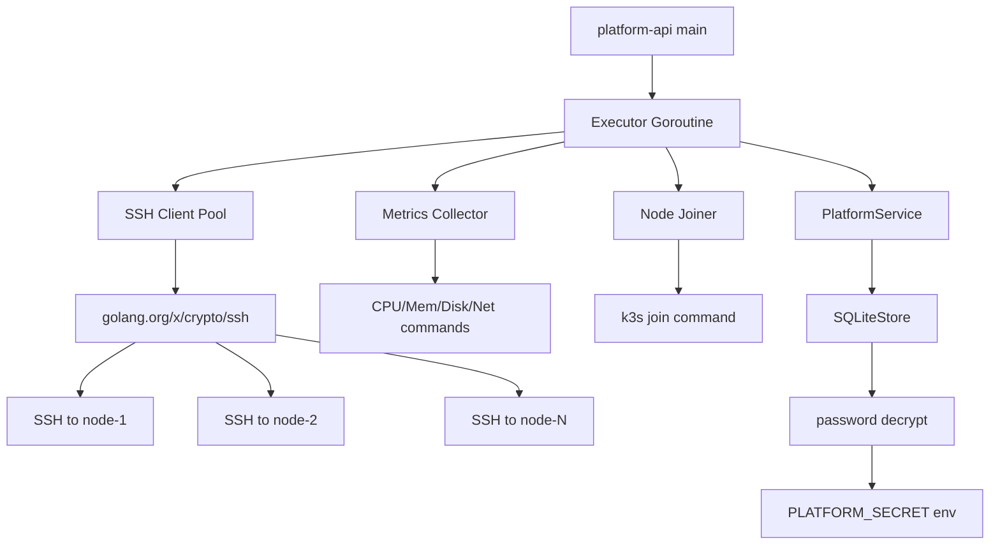

# 内置 SSH 执行器

Feature Name: builtin-ssh-executor
Updated: 2026-06-27

## Description

在 platform-api 进程内嵌入 SSH 执行器，替换所有模拟指标和 "pending executor" 空状态。通过标准 SSH 协议远程执行运维指令：采集 CPU/内存/磁盘/网络指标、执行 k3s join 纳管新节点。SSH 密码使用 AES-256-GCM 加密存储。连接失败时静默回退为 `normalize()` 估算数据，不中断平台服务。

## Architecture



执行器作为 `PlatformService` 的内部组件，在 `NewPlatformService` 时启动后台 goroutine。每个 Poll Cycle 并行连接所有已配置 SSH 的节点，采集完成后通过 `store.Replace()` 持久化。`normalize()` 降级为仅对新节点补充初始值，不再填充随机指标。

## Components and Interfaces

### 1. Executor (`internal/executor/executor.go`)

新包，与平台服务松耦合：

```
type Executor struct {
    store      StoreAccess
    pollTick   *time.Ticker
    sshTimeout time.Duration
    passwordKey []byte
}
```

- `Start(ctx)`: 启动 Poll Cycle goroutine
- `Stop()`: 停止 ticker
- `pollOnce()`: 单次采集周期，对每个节点调用 `collectNode()` 和 `tryJoin()` 

### 2. SSH Client (`internal/executor/ssh.go`)

```
func sshConnect(host string, port int, user string, password []byte, timeout time.Duration) (*ssh.Client, error)
func sshExec(client *ssh.Client, cmd string, timeout time.Duration) (string, error)
```

### 3. Metrics Collector (`internal/executor/metrics.go`)

远程命令（Linux 兼容）：

| 指标 | 命令 |
|------|------|
| CPU% | `top -bn1 \| grep 'Cpu(s)' \| awk '{print $2+$4}'` |
| Mem% | `free \| grep Mem \| awk '{printf "%.1f", $3/$2*100}'` |
| Disk% | `df / \| tail -1 \| awk '{print $5}' \| tr -d '%'` |
| RxBytes/TxBytes | `cat /sys/class/net/{nic}/statistics/{rx_bytes,tx_bytes}` |
| RxRate/TxRate | 两次采集间差值 / 间隔秒数 |

### 4. Node Joiner (`internal/executor/join.go`)

```
func tryJoinNode(store StoreAccess, node ClusterNode, sshClient *ssh.Client) error
```

- 检查 `joinStatus == "credential_ready"` 且 `joinCommand` 非空
- 执行 `joinCommand`（已在注册时生成）
- 成功 → `joinStatus = "active"`
- 失败 → `joinStatus = "failed"`，记录错误到 `lastJoinMessage`

### 5. Password Manager (`internal/executor/crypto.go`)

```
func encryptPassword(plaintext string, key []byte) (string, error)
func decryptPassword(ciphertext string, key []byte) (string, error)
```

- 算法: AES-256-GCM
- 密钥来源: `PLATFORM_SECRET` 环境变量（已有）
- Nonce: 随机 12 字节，与密文一同 base64 编码存储

### 6. 与 PlatformService 集成

修改 `internal/service/platform.go`:

```
type PlatformService struct {
    store    *store.SQLiteStore
    writeMu  sync.Mutex
    executor *executor.Executor  // 新增
}

func NewPlatformService(store *store.SQLiteStore) *PlatformService {
    ps := &PlatformService{store: store}
    ps.executor = executor.New(executor.Config{
        Store:       store,
        PasswordKey: []byte(os.Getenv("PLATFORM_SECRET")),
        PollSeconds: getEnvInt("EXECUTOR_POLL_SECONDS", 10),
        SSHTimeout:  getEnvDur("EXECUTOR_SSH_TIMEOUT_SECONDS", 8),
    })
    ps.executor.Start(context.Background())
    return ps
}
```

删除原有的 `refreshNetworkMetrics()` 函数（第 356-373 行），该功能由 executor 接管。

## Data Models

### ClusterNode 字段变更

| 字段 | 变更 | 说明 |
|------|------|------|
| `sshPasswordCiphertext` | **新增** | base64(AES-256-GCM(随机12B nonce + 密文 + 16B tag)) |
| `sshPasswordConfigured` | 保留 | 标记密码是否已设置 |
| `lastHeartbeat` | 语义变更 | 原为种子数据时间戳，现为 executor 最近一次成功采集时间 |
| `joinStatus` | 状态值扩展 | 新增 `"active"` 和 `"failed"` |

### 移除字段

`ClusterNode` 中删除 `sshPassword` 的 JSON 序列化（`json:"-"`），API 层创建节点时直接加密存储。

## Correctness Properties

1. 执行器的任何 panic 由 recover 捕获，不传播到 API 主协程
2. SSH 密码明文仅在 `decryptPassword` 函数调用栈内存在，函数返回后立即清空
3. Poll Cycle 使用 `store.Replace()` 原子写入，保证快照一致性
4. 并行采集使用 `sync.WaitGroup`，所有节点完成后一次性 `Replace`

## Error Handling

| 场景 | 处理 |
|------|------|
| SSH 认证失败 | `WARN` 日志 + 跳过节点 + 保留上次数据 |
| SSH 连接超时 | `WARN` 日志 + 跳过节点 + 保留上次数据 |
| 远程命令执行失败 | `WARN` 日志 + 该指标字段不更新 |
| Join 命令失败 | 更新 `joinStatus=failed` + `lastJoinMessage=错误信息` |
| PLATFORM_SECRET 未设置 | `log.Fatal` 拒绝启动 |
| 密码解密失败 | 跳过该节点 + `WARN` 日志 |
| executor panic | recover + `ERROR` 日志 + executor goroutine 重启 |

## Test Strategy

1. **单元测试**: SSH connect/exec mock, password encrypt/decrypt round-trip, metrics parsing
2. **集成测试**: 使用 `PLATFORM_SECRET=test-secret` 创建节点，观察 executor 采集周期和回退行为
3. **回退测试**: 未配置 SSH 的节点，确认 `normalize()` 生成的初始数据正常展示
4. **边界测试**: 空密码、无 SSH 主机、无效端口

## Implementation Steps

1. 创建 `internal/executor/` 包骨架
2. 实现 `crypto.go`（密码加解密）
3. 实现 `ssh.go`（连接和执行）
4. 实现 `metrics.go`（指标采集和解析）
5. 实现 `join.go`（节点纳管）
6. 实现 `executor.go`（调度编排）
7. 修改 `PlatformService` 集成 executor
8. 修改 `normalize()` 不再填充随机指标
9. 删除 `refreshNetworkMetrics()`
10. 修改 `Store` 层支持 `sshPasswordCiphertext` 字段
11. 更新 `seed.go` 移除旧密码占位符
12. 更新前端适配新字段和状态值
