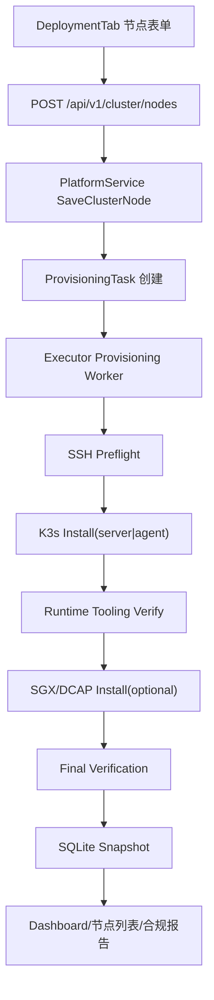

# 节点自动装机与纳管

Feature Name: node-auto-provisioning
Updated: 2026-06-27

## Description

本设计将 SGX OneBox Platform 的节点新增能力升级为自动装机与自动纳管流程。平台管理员在现有“交付与部署 > 节点”页面录入目标节点 SSH 信息、角色、安装模式和 SGX 能力后，平台创建自动装机任务，由内置 SSH 执行器在目标节点执行前置检查、K3s server/agent 安装、kubectl/container runtime 验证、SGX 驱动与 DCAP 工具链安装、最终健康检查和审计记录。

设计重点是保留现有页面风格和 API 结构，扩展节点表单、节点状态、任务状态与 executor 操作。无执行条件时保持 `pending`、`failed`、`sgx_pending` 等明确状态，继续遵循“不假成功”的原则。

## Architecture



现有 `internal/executor` 继续承担 SSH 连接、命令执行和超时控制。新增 provisioning worker 在 executor 内按任务状态调度，不在 HTTP handler 中执行长耗时安装。API 创建节点后立即返回节点与任务状态，前端通过现有 `loadData()` 轮询 dashboard snapshot 展示阶段进度。

## Components and Interfaces

### 1. 前端节点表单

文件：`apps/web/src/components/DeploymentTab.tsx`

保留现有卡片、表格、badge、按钮样式。节点新增表单扩展字段：

- `provisionMode`: `online` 或 `offline`
- `nodeRole`: `control-plane` 或 `worker`
- `enableSGX`: boolean
- `offlineBundleId`: 离线资源包 ID
- `controlPlaneEndpoint`: worker join 使用的控制面地址
- `installChannel`: K3s 版本通道或版本号

节点列表新增“装机阶段”列，展示任务总状态和当前步骤，例如 `preflight_running`、`k3s_installing`、`sgx_pending`、`ready`。

### 2. API 层

文件：`internal/api/server.go`

复用现有节点接口：

- `POST /api/v1/cluster/nodes`：保存节点并创建自动装机任务
- `GET /api/v1/dashboard`：返回节点、任务、日志、告警

新增接口：

- `POST /api/v1/provisioning-tasks/{id}/retry`：从失败阶段重试
- `POST /api/v1/provisioning-tasks/{id}/cancel`：取消未完成任务
- `GET /api/v1/provisioning-tasks/{id}`：查看任务详情

### 3. Service 层

文件：`internal/service/platform.go`

新增方法：

```go
func (s *PlatformService) CreateProvisioningTask(node domain.ClusterNode, actor string) (domain.ProvisioningTask, error)
func (s *PlatformService) RetryProvisioningTask(id string, actor string) error
func (s *PlatformService) CancelProvisioningTask(id string, actor string) error
func (s *PlatformService) SaveProvisioningTaskStatus(task domain.ProvisioningTask) error
```

`SaveClusterNode` 在保存节点后根据 `AutoProvision` 字段创建任务。已有 `JoinCommand` 生成逻辑调整为 K3s agent 阶段的一部分，token 继续执行时注入并脱敏。

### 4. Executor 层

文件：`internal/executor/provisioning.go`

新增步骤执行器：

```go
type ProvisioningStepRunner interface {
    RunPreflight(node domain.ClusterNode, task domain.ProvisioningTask) StepResult
    InstallK3sServer(node domain.ClusterNode, task domain.ProvisioningTask) StepResult
    InstallK3sAgent(node domain.ClusterNode, task domain.ProvisioningTask) StepResult
    VerifyRuntime(node domain.ClusterNode, task domain.ProvisioningTask) StepResult
    InstallSGXDCAP(node domain.ClusterNode, task domain.ProvisioningTask) StepResult
    VerifyNodeReady(node domain.ClusterNode, task domain.ProvisioningTask) StepResult
}
```

执行器按任务步骤串行执行，同一任务只允许一个 worker 运行。多个节点任务可并行执行，需限制最大并发数，默认 3。

## Data Models

### ClusterNode 扩展

```go
type ClusterNode struct {
    ProvisionMode string `json:"provisionMode"`
    AutoProvision bool `json:"autoProvision"`
    EnableSGX bool `json:"enableSgx"`
    ProvisionStatus string `json:"provisionStatus"`
    ProvisionTaskID string `json:"provisionTaskId"`
    SGXStatus string `json:"sgxStatus"`
    RuntimeStatus string `json:"runtimeStatus"`
    K3sRole string `json:"k3sRole"`
}
```

### ProvisioningTask

```go
type ProvisioningTask struct {
    ID string `json:"id"`
    NodeID string `json:"nodeId"`
    Actor string `json:"actor"`
    Mode string `json:"mode"`
    Role string `json:"role"`
    EnableSGX bool `json:"enableSgx"`
    OfflineBundleID string `json:"offlineBundleId"`
    Status string `json:"status"`
    CurrentStep string `json:"currentStep"`
    Steps []ProvisioningStep `json:"steps"`
    CreatedAt string `json:"createdAt"`
    UpdatedAt string `json:"updatedAt"`
}
```

### ProvisioningStep

```go
type ProvisioningStep struct {
    Name string `json:"name"`
    Status string `json:"status"`
    StartedAt string `json:"startedAt"`
    FinishedAt string `json:"finishedAt"`
    Message string `json:"message"`
    Evidence string `json:"evidence"`
}
```

### OfflineBundle

安装包模型扩展为可被自动装机引用：

```go
type OfflineBundleManifest struct {
    K3sVersion string `json:"k3sVersion"`
    RuntimeVersion string `json:"runtimeVersion"`
    KubectlVersion string `json:"kubectlVersion"`
    SGXDriverVersion string `json:"sgxDriverVersion"`
    DCAPVersion string `json:"dcapVersion"`
    OSFamily []string `json:"osFamily"`
    SHA256 map[string]string `json:"sha256"`
}
```

## Provisioning Workflow

### Step 1: Preflight

执行命令摘要：

- `uname -m`
- `cat /etc/os-release`
- `df -BG /`
- `free -m`
- `command -v curl || command -v wget`
- `systemctl is-active ssh`
- SGX 场景执行 `grep -i sgx /proc/cpuinfo`、`ls /dev/sgx_*`

输出被裁剪并脱敏后写入 step evidence。

### Step 2: K3s install

控制面节点：

- 在线模式：使用配置的 K3s 安装脚本和目标版本
- 离线模式：上传离线二进制、镜像和 service 文件后安装
- 验证：`k3s kubectl get nodes`

工作节点：

- 读取控制面 endpoint
- 执行 agent 安装
- token 通过执行时环境变量注入
- 验证目标节点出现在控制面节点列表

### Step 3: Runtime tooling

验证 `containerd`、`crictl` 或 `ctr`。K3s 自带 containerd 时记录版本。缺少 `crictl` 时从在线源或离线包安装。

### Step 4: SGX/DCAP

启用 SGX 时执行：

- SGX 硬件检测
- 安装驱动、PSW、DCAP QPL、PCCS 配置或本地验证配置
- 检查 `/dev/sgx_enclave`、`/dev/sgx_provision`
- 检查 `dcap-verify-quote` 或平台指定验证工具

SGX 阶段失败时，K3s 纳管结果保留，节点 `SGXStatus` 写为 `sgx_pending` 或 `sgx_failed`。

## Correctness Properties

1. 自动装机任务的阶段状态只能按 `pending -> running -> succeeded|failed|skipped` 转换。
2. K3s token、SSH 密码和其他凭据只在执行时解密或注入，API 响应和持久化日志仅保留脱敏值。
3. 同一节点同一时间只有一个自动装机任务处于 `running` 状态。
4. 目标节点未通过 preflight 时，安装阶段保持 `pending`。
5. SGX 阶段失败不会覆盖已成功的 K3s 节点状态。
6. 任何远程命令失败都会记录阶段失败和输出摘要，节点不会被标记为 `ready` 或 `sgx_ready`。

## Error Handling

| 场景 | 处理 |
|---|---|
| SSH 连接失败 | 任务 `failed`，步骤 `preflight failed`，节点 `provision_failed` |
| OS 不兼容 | 任务 `failed`，输出兼容性建议 |
| 离线包缺失 | 阻止进入安装阶段，提示导入资源包 |
| K3s server 安装失败 | 任务 `failed`，保留远程输出摘要 |
| K3s worker join 失败 | 任务 `failed`，保留 token 脱敏后的 join 结果 |
| runtime 工具缺失且安装失败 | 任务 `failed`，节点保持 `runtime_pending` |
| SGX 硬件缺失 | SGX 步骤 `failed`，节点保留 K3s 纳管状态 |
| DCAP 工具安装失败 | SGX 步骤 `failed`，节点 `sgx_pending` |
| 任务取消 | 未执行步骤 `skipped`，任务 `cancelled` |

## UI Design Notes

页面继续使用现有 `DeploymentTab` 的 panel、form-grid、table、badge 和按钮样式。功能调整集中在字段、状态和操作：

- 节点新增表单从“登记节点”升级为“添加并自动准备节点”。
- 节点表格展示“装机任务状态”和“SGX 状态”。
- 每行增加“查看进度”“重试”“取消”操作。
- 进度详情使用现有 panel 样式展示步骤列表。
- 状态文案采用“已提交、执行中、等待资源、失败、已就绪”，避免显示假成功。

## Test Strategy

1. Service 单元测试：创建控制面、worker、SGX 节点时生成正确步骤列表。
2. Executor 单元测试：mock SSH 命令输出，覆盖 preflight、K3s、runtime、SGX 成功与失败。
3. 安全测试：确认 token 和密码在 task evidence、cluster logs、API 响应中脱敏。
4. API 测试：覆盖 task retry、cancel、detail 权限和状态转换。
5. 前端类型检查：新增字段类型与 dashboard snapshot 对齐。
6. E2E smoke：创建节点后看到 `pending/running` 状态，缺少执行依赖时保持明确失败状态。

## Implementation Steps

1. 扩展 domain models：`ProvisioningTask`、`ProvisioningStep`、`OfflineBundleManifest`、节点状态字段。
2. 扩展 store snapshot：新增 `ProvisioningTasks`，保留 SQLite snapshot 持久化方式。
3. 修改 `SaveClusterNode`：支持 `AutoProvision` 创建任务。
4. 新增 executor provisioning worker：按任务执行 preflight、K3s、runtime、SGX、verify。
5. 新增 API：task detail、retry、cancel。
6. 修改前端 `DeploymentTab`：扩展节点表单、表格、进度详情。
7. 修改安装包导入：识别离线资源包 manifest 并校验 SHA256。
8. 修改合规报告：引用 provisioning evidence。
9. 补充单元测试、API 测试、前端类型检查和 smoke 测试。

## References

[^1]: `.monkeycode/specs/sgx-onebox-platform/requirements.md` - 原始平台需求中部署与交付、节点接入、SGX 依赖要求。
[^2]: `.monkeycode/specs/builtin-ssh-executor/design.md` - 当前 SSH 执行器设计基础。
[^3]: `internal/service/platform.go` - 当前节点保存、join command、执行器集成所在文件。
[^4]: `internal/executor/join.go` - 当前 K3s join 执行逻辑所在文件。
[^5]: `apps/web/src/components/DeploymentTab.tsx` - 当前节点页面与部署管理入口。
