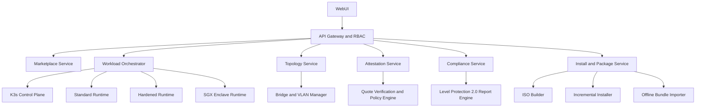

# SGX 等保一体机平台重设计

Feature Name: sgx-onebox-platform
Updated: 2026-06-17

## Description

本次重设计把平台定位为“单机交付优先、可平滑扩展到小型集群”的等保一体机。平台以 K3s 作为控制与编排核心，以 Intel SGX 作为高等级组件可信执行基础，以加固容器作为中间隔离层，以统一管理平面承接运维管理、合规管理、组件市场和拓扑编排四大能力。交付层支持 ISO 一键安装、已装 Linux 增量安装和离线包导入。业务层同时提供内置组件市场、模板仓库与通用接入框架，支持用户自带镜像导入和多语言飞地改造。

## Architecture

整体采用分层设计。控制平面由 API Gateway and RBAC 统一承接认证、授权、审计、限流和路由。Marketplace Service 维护内置组件目录、模板仓库和自带镜像接入框架。Workload Orchestrator 负责编排组件生命周期，并根据三级隔离标准映射到标准运行时、加固运行时或 SGX 飞地运行时。Topology Service 管理 bridge、物理网卡、VLAN 子接口、组件网络附件和拓扑视图。Attestation Service 围绕等保 2.0 可信控制项组织 Quote 校验、证据采集与密钥释放。Compliance Service 聚合资产、镜像、配置、网络、证明和审计证据，输出等保 2.0 合规报告。Install and Package Service 提供 ISO 构建、增量安装和离线包导入。

## Components and Interfaces

- `api-gateway`: 提供 `/api/v1/*`，承载认证、RBAC、审计、菜单裁剪和错误收敛。
- `marketplace-service`: 管理内置组件市场、模板仓库、版本发布和用户镜像导入。
- `adapter-framework`: 提供多语言飞地改造模板、镜像封装规则和兼容性分析。
- `workload-orchestrator`: 管理部署、扩缩容、回滚、下线和运行时映射。
- `topology-service`: 管理 bridge、VLAN、物理网卡、网络附件和依赖流向。
- `attestation-service`: 管理 SGX 远程证明、证据结构化输出和密钥释放门禁。
- `compliance-service`: 管理等保 2.0 检查规则、证据归集、评分和报表导出。
- `install-service`: 管理 ISO 产物、Linux 增量安装和离线资源包导入。

## Data Models

- `ComponentCatalogItem`: 组件市场条目，包含分类、版本、模板、适用隔离级别和依赖信息。
- `ImportedImage`: 用户导入镜像，包含签名、摘要、SBOM、漏洞和兼容性状态。
- `WorkloadProfile`: 组件实例定义，包含隔离级别、资源、网络、运行策略和版本轨迹。
- `IsolationPolicy`: 三级隔离策略，定义普通容器、加固容器和 SGX 飞地的运行约束。
- `TopologyGraph`: 网络拓扑模型，包含节点、链路、bridge、VLAN、网段和组件附件。
- `AttestationEvidence`: 远程证明证据，包含度量值、控制项、策略结果、证据摘要和密钥释放状态。
- `ComplianceReport`: 等保 2.0 报表，包含控制项编号、检查结果、风险等级和整改建议。
- `UserAccount`: 平台账号模型，包含平台管理员、安全管理员、运维员和审计员角色。

## Correctness Properties

1. 高等级组件必须通过隔离级别与运行时策略的双重校验。
2. SGX 飞地组件只有在远程证明通过后才能获得敏感配置。
3. 合规报表中的每个控制项都必须绑定证据来源和生成时间。
4. 网络拓扑变更必须经过冲突检测和事务化下发。
5. 组件发布必须绑定镜像摘要、模板版本和审计轨迹。
6. 单机控制平面输出的数据结构必须兼容后续多节点扩展。

## Error Handling

镜像导入失败时返回缺失元数据、签名异常或模板依赖异常。飞地改造失败时返回语言适配受限项和替代隔离建议。网络配置失败时回滚 bridge 与 VLAN 变更。远程证明失败时封禁密钥释放并生成告警。合规检查失败时保留已完成证据并允许增量复跑。离线包导入失败时返回包签名、依赖或版本冲突明细。

## Test Strategy

后端采用 Go 单元测试、接口集成测试和规则引擎测试。前端采用类型检查、组件测试和角色菜单测试。组件市场需要覆盖模板解析、版本选择和离线导入校验。三级隔离策略需要覆盖标准容器、加固容器和 SGX 飞地三类运行时映射。远程证明链路需要覆盖 Quote 回放、策略匹配和证据结构化输出。安装能力需要覆盖 ISO 产物校验、增量安装前置检查和离线包验签流程。
